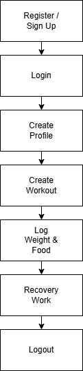
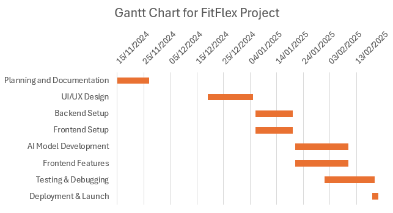

# 3rd Year Project Functional Specification

# 0. Table of contents
## 1. Introduction
**1.1 Overview**

**1.2 Business Context**

**1.3 Glossary**

## 2. General Description
**2.1 Product / System Function**

**2.2 User Characteristics and Objectives**

**2.3 Operational Scenarios**

**2.4 Constraints**

## 3. Functional Requirements
**3.1 Signup / Register**

**3.2 Create Profile**

**3.3 Login**

**3.4 Edit Profile**

**3.5 Add / Remove Friends**

**3.6 Delete Profile**

**3.7 Workout & Diet Tracking**

**3.8 Nutrition Tracking**

**3.9 Workout Recovery**

## 4. System Architecture
**4.1 Application**

**4.2 MongoDB Database**

**4.3 Django Server**

## 5. High-Level Design
**5.1 High-Level Design Diagram**

**5.2 High-Level Design Description**

## 6. Preliminary Schedule
**6.1 Gantt Chart for FitFlex Project**

## 7. Appendices

# 1. Introduction
## 1.1 Overview
The web application that we intend to develop will allow people to easily understand and achieve their fitness goals. Users will
have their very own workouts built for them by our artificial intelligence model, track and understand their dietary needs and set
goals and targets for them to achieve.

The system will be built with the need for a growing population where human fitness levels are simply not being met to the correct
standard. A huge amount of our population are lazy and struggle to understand how to properly exercise. Our application will give
them this opportunity with the ease of just inputting some simple information and goals they wish to achieve. FitFlex users will
also be able to track their calorie intake and understand where they are going wrong in their diet.

Finally, we were also thinking of creating some form of recovery plan section, whereby users can gain vital information about
recovering from their high intensity workouts. This function is certainly still in the early stages. Users will be able to keep
track of these features through their profile and go back to them when necessary. 

## 1.2 Business Context
As an individual start up our web application could only be used for a couple of business reasons as we see it.

##### Selling to a Company or Organisation

Our application could be sold to a number of large fitness organisations and health providers around the globe to help their
communities hit their fitness goals.

##### Freemium with Upselling Opportunities

We could market our application so that our users might only be able to generate a certain number of workouts per year for free and
then may need to upgrade to a more advanced subscription tier. This could be useful to create recurring revenue.

##### Advertising

Our web application could boast a certain amount of paid advertisements by companies that are looking to market to our target
audience such as fitness clothing brands or fitness food brands. This again would generate our application a recurring revenue
stream.

## 1.3 Glossary

**React.js:** A JavaScript library for building user interfaces, particularly single-page applications, by creating reusable
components that manage their own state.

**Django:** A high-level, open-source Python web framework designed to facilitate the rapid development of secure and maintainable
web applications.

**Node.js:** A JavaScript runtime environment that executes JavaScript code outside a web browser. It is commonly used for
server-side development.

**MongoDB:** A NoSQL database that stores data in a flexible, JSON-like format. It is highly scalable and suitable for applications
requiring a dynamic schema.

**Rest API:** Stands for Representational State Transfer Application Programming Interface. A standard for enabling communication
between systems over HTTP.

**HTML:** The standard language for creating and structuring content on the web. It is used in conjunction with CSS and JavaScript
to build web pages.

# 2. General Description
## 2.1 Product / System Functions

Below is a list of the preliminary functions we want to incorporate into our project. In the future this list is open to change but
these are the core functions we want to have in our web application FitFlex.

##### Profile

The application will allow users to create their own profile, this is important as it allows the application to be personalised.
In this application the functionalities will include:

- Sign Up
- Create Profile
- Login
- Add / Remove Friends
- Edit Profile
- Delete Profile
- Logout

##### Workout / Diet Tracking

Users can log their workout and compare it to their previous workouts. Functionalities for tracking your workouts will include:

- Log Sets
- Log Reps
- Log Weight
- Log Time

##### Nutrition Tracking

Users can track their food/drink and calculate their total calories for the day. There will be a different section for Breakfast,
Lunch and Dinner. Users can also see their breakdown of macronutrients (carbohydrates, fat and protein) functionalities will
include:

- Add Food
- Add Drink

## 2.2 User Characteristics and Objectives
### User Characteristics
##### Accessibility:

The system will be hosted online, ensuring accessibility for anyone with a computer    and an internet connection.

##### Targeted Audience:

Our target audience will be anybody who is looking to get into the world of fitness. Our application will be important for new and
experienced users in the field of fitness and we’re hoping it will ultimately be applicable to anybody.

##### Personal Trainers:

Additionally, the system aims to attract users interested in personal training, accommodating their need for an all in one app.

### User Objectives and Requirements
##### User-Friendly Interface:

The primary objective is to provide a user-friendly interface to accommodate users with varying levels of software proficiency.
Although some consumers may already be familiar with online technologies, the system design will not assume prior expertise,
ensuring usability for all. This is why we will create a user interface that is easy to navigate, easy to use, while also being the
right balance of complexity in the backend.

 

## 2.3 Operational Scenarios
When users are using our application they will have very limited use without creating a profile, so we will compare both:

### Unregistered Users

An unregistered user will have very limited functionality in this application, this is because of the functionality coming from the
users input. They will still be able to see the home page but when they try to access anything that requires input a signup/login
page will appear.

##### Functionalities for unregistered users include:
- Sign up
- Login 

### Registered Users

A logged in user will have access to all of the functionalities of the application. 

##### Functionalities for registered users include:
- Sign up
- Create Profile
- Login
- Edit Profile
- Delete Profile
- Log Out
- Log Sets
- Log Reps
- Log Weight
- Log Time
- Add Food
- Add Drink

##### Creating an Workout/Diet plan:

When a user wants to create a workout plan they will have to fill out a form indicating how many days they want to workout a week,
their goals and their maintenance calories and depending on whether they want to gain weight or lose weight their diet plan will be
created

##### Logging Out
Users can log out by clicking their profile icon, triggering a pop-up displaying account information and featuring a logout button
at the bottom.

## 2.4 Constraints

##### Database Memory

While using MongoDB provides flexibility, the memory available on the server for the database could be a limiting factor. As more
users sign up and log workouts, track nutrition, and store profiles, the database size will grow. Without proper indexing or data
archiving, performance could degrade.

##### Internet Connectivity

As a web-based application, the system's functionality depends heavily on stable and fast internet connectivity, both for users and
the server. Slow connections might impact the real-time generation of workout plans.

##### User Privacy and Security
The app will need to comply with data protection laws such as GDPR. This adds complexity to how user data is stored, managed, and
deleted. Encrypting sensitive user data adds overhead to development and testing efforts.

##### Time Constraint
With our project deadline being just the 21st of February we will not have long to design and then implement our designs to our
projects. 

# 3. Functional Requirements

## 3.1 Signup / Register
##### Description:
Signing up or registering to our web application will be the first thing a user will have to do in order to gain access to our web
page. Users will be asked to fill in a series of questions about themselves and set up a username and password in which they will
use to log back in again in the future.

##### Criticality:
This function is essential to our web application in that it allows our users to create and keep a log of their workouts. It
provides them with an individual area that holds only their information and set plans and therefore is, without question, necessary.

##### Technical Issues:
We will create this form using HTML and save all of its information in our MongoDB database model. This will handle any further
requests we have in the future when trying to re-access a user's account at another point in time and displaying the same
information they already had.

##### Dependencies with other requirements:
This section shouldn’t have any dependencies.

## 3.2 Create Profile
##### Description:
After the initial completion of the users registration form, the user will be redirected to a page whereby they will be asked to
input some personal information about themselves such as name, date of birth, nationality, etc. This form is purely optional for
the user to personalise their own profile but of course is not necessary for completing the set up of their profile in case they
would prefer to stay anonymous.

##### Criticality:
This function allows the user to have a sense of individuality on our web page, allowing them to set themselves apart from others.
Although this function is not as important as the previous function, we believe it is still essential to provide this accessibility
to all users.

##### Technical Issues:
Again our form will be set up using HTML and all saved personal information will be attached to their individual profiles in our
MongoDB database.

##### Dependencies with other requirements:
This area is dependent on users having already registered in the previous step.

## 3.3 Login
##### Description:
Our login section will be a prompt that allows a user to re-enter our web application with all the previous details they have
already input. Because all of our information is stored on our database users will still have access to all of their previous
information by our system referencing back to their registration information they provided.

##### Criticality:
This function is crucial to the running of our web application. Without users being able to access their previous information, they
would not, for example, be able to interact with the previous workout routines that were built for them.

##### Technical Issues:
With keeping a record of information our system would have to have a security system in place to deny access to unauthorised users.

##### Dependencies with other requirements:
Our login system would be dependent on users already having registered for an account.

## 3.4 Edit Profile
##### Description:
Even though users have already given us some elementary information about them, we will have our edit profile feature whereby users
can edit the information in their profile by either adding more information about themselves or removing information they decide
they might actually prefer to keep private.

##### Criticality:
This function is not vital to the running of our application but may be a nice feature for users to be able to adjust the
information they put out into the world.

##### Technical Issues:
When prompted, a user's information will be called from our MongoDB database and will then be saved with the new information given.

##### Dependencies with other requirements:
A user will have had to register in step 1 for this operation to be available.

## 3.5 Add / Remove Friends
##### Description:
This function will allow users to keep a list of their friends on our web application. Users will be able to view their friends
profiles and see their profile information that they have decided to input in step 2. Finally, users will also be able to remove
friends if they don’t want particular users seeing their personal information.

##### Criticality:
Again this function is not particularly crucial to the running of our application but it is a nice feature to have for users to be
able to connect with their friends online.

##### Technical Issues:
Should not be any technical issues here.

##### Dependencies with other requirements:
This function will be dependent on users having registered and being able to login.

## 3.6 Delete Profile
##### Description:
This feature will be vital for any users that don’t want a profile on our web application anymore for whatever reason. Deleting a
profile will erase all information pertaining to that user from our database.

##### Criticality:
This function is very important both for the user and for our site administrators. It deletes a user's profile for them so they
don’t have to worry about their information still being stored on our system and it’s also good for us as it removes a user,
freeing up space in our database.

##### Technical Issues:
There should not be any technical issues with deleting a user on our web application. A user will be prompted to be sure that they
are happy to delete their account and once they click “Yes”, their account will be erased from our MongoDB database and they will
be redirected to our home page whereby users regularly sign up.

##### Dependencies with other requirements:
This function will also be dependent on a user having an account registered and being able to regularly login.

## 3.7 Workout & Diet Tracking
##### Description:
Creating a workout will be a core function in our web application. In this section a user will input a series of information about
themselves and our artificial intelligence model will then create a workout plan for them to follow to achieve the aims they have
set for themselves.

##### Criticality:
This feature is vital to the completion of our project. It is the center at which we based the whole web application around and
without it we would not have a working design. Users should be attracted to our web application because of this feature alone.

##### Technical Issues:
We will be training our own artificial intelligence API which will certainly be a tricky and difficult task. We will be using an
open source dataset to do this, which again will be difficult but something that we will have overcome.

##### Dependencies with other requirements:
To have access to creating a workout plan a user will have to have registered and set up a login so they can keep track of their 
workout plans.

## 3.8 Nutrition Tracking
##### Description:
In this function our users will be able to track their calories consumed and understand the breakdown of how food is impacting
their workouts. Users will be able to log their food consumed and understand what the remainder of their calorie intake should look
like.

##### Criticality:
This feature is fairly important to our system but it is something that a lot of people struggle with. Keeping track of what you
should be eating is vital to hitting your fitness goals and therefore is essential for our web application.

##### Technical Issues:
There should not be many complications with creating a calorie tracker. A user simply inputs their food information and we store it
on our system and then send this information back to the user with what else they need to consume for the day.

##### Dependencies with other requirements:
Again, a user will have to have registered to our site and created a login.

## 3.9 Workout Recovery
##### Description:
This section of our web application will give our users access to recovery advice after their workouts. It will offer a range of
recovery options such as stretching, high nutrient foods and even other solutions such as cold water plunges. It will be a section
where users can be rest assured that there is something they can do to recover in a better way.

##### Criticality:
This section is not essential to our overall goal for the web application but we thought it would be a nice addition for users to
be able to have a “One stop shop” for all things training and workouts.

##### Technical Issues:
There should not be any technical issues in this portion of our web application as we will just be showing examples of what is good
for everybody and giving other sources of information that may be useful to our users.

##### Dependencies with other requirements:
This section will be dependent on registering.

# 4. System Architecture

## 4.1 Application

The application is the front end and the backend of the project.

##### Frontend
Our frontend will be built using React.js which is responsible for creating an interactive and responsive user interface. Users will interact with this layer to sign up, log in, create profiles, track workouts, and view AI-generated workout plans.

##### Backend
The backend of our project will be built using Django and Node.js. Django will be in charge of user authentication, workout generation and profile management. Node.js on the other hand will serve to handle smooth data flow between the front and the backend of our project.

## 4.2 MongoDB Database

The MongoDB database is where we will store things like our user profiles, workout logs, etc. MongoDB is an ideal system for evolution over time with its flexible schema that supports dynamic changes in data structures. MongoDB integrates with the Django backend, which retrieves and updates user data as needed.

## 4.3 Django Server

The Django server will do most of the heavy lifting of the application stack. It is the backbone of our system and will serve to handle complex operations. 

##### Key responsibilities include:
- Processing user inputs
- Managing user authentication
- Connection our database and frontend to facilitate dataflow
- Serving API endpoints for the frontend to interact with the system

Django will ultimately allow for a robust and functional server as our user base scales.

# 5. High-Level Design

## 5.1 High-Level Design Diagram

## 5.2 High-Level Design Description
 
##### Step 1: Register/Sign Up
- Register a username and password to give you the ability to login to the site.
 
##### Step 2: Login
- Log In using the username and password that were decided in sign up. 

##### Step 3: Create Profile
- Input your personal details. This information will be displayed on your public profile.

##### Step 4: Create Workout
- After logging in, put in your goals and details and plan will be set for you.

##### Step 5: Log Weight & food
- Press the icon log food to log food and and log weight to log the weight on the exercise you did.

##### Step 6 Recovery Work
- Scroll through a series of helpful recovery tips to add into your day to day life!

##### Step 7: Log Out
- Once you have finished using the various features of the site, you can then log out.

# 6. Preliminary Schedule
Figure 6.1 below shows the dates at which we believe we will be able to start and finish the main different components in our project. 

Our Gantt chart shows the date at which work will commence, a span of how long this particular piece of work should take to complete and finally, each individual task we must undertake.

This is purely for visual purposes but is also a span at which we hope to keep our development under in order to deliver our product on time and to the standard that we’ve set.

##### 6.1 Gantt Chart for FitFlex Project

# 7. Appendices
## 7.1 Appendix 1
**Similar Apps:**

Fitness AI: https://www.fitnessai.com/

Easy-Peasy AI: https://easy-peasy.ai/templates/workout-plan-generator

**Research Tools:** Youtube & Google

## 7.2 Appendix 2
**Reactjs usage:** https://react.dev/reference/react

**Nodejs usage:** https://nodejs.org/docs/latest/api/

**Django usage:** https://docs.djangoproject.com/en/5.1/

**MongoDB usage** https://www.mongodb.com/docs/